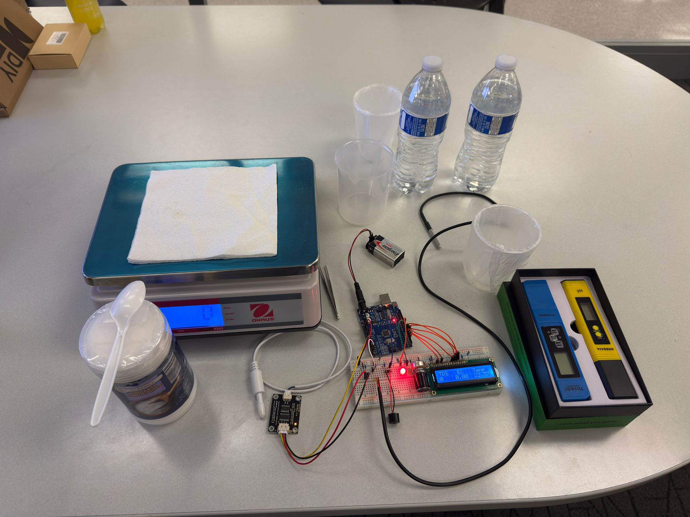
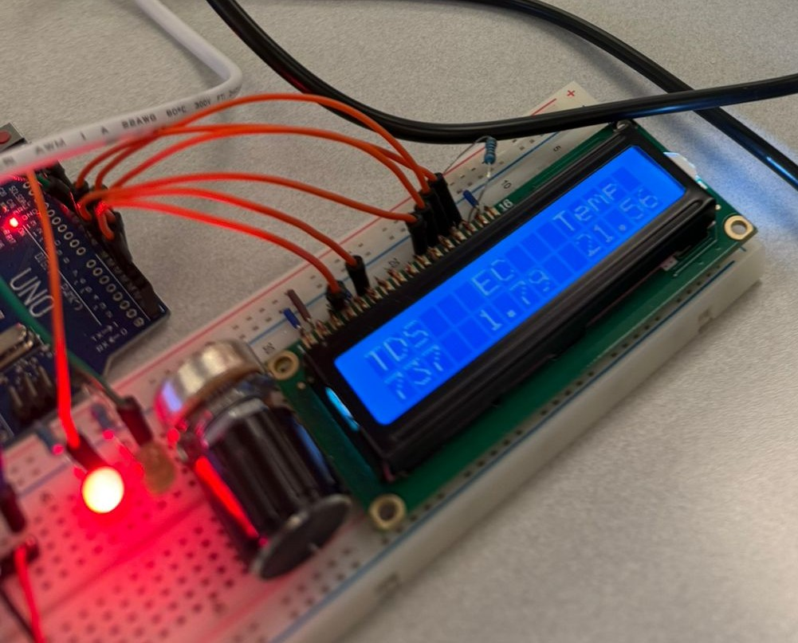
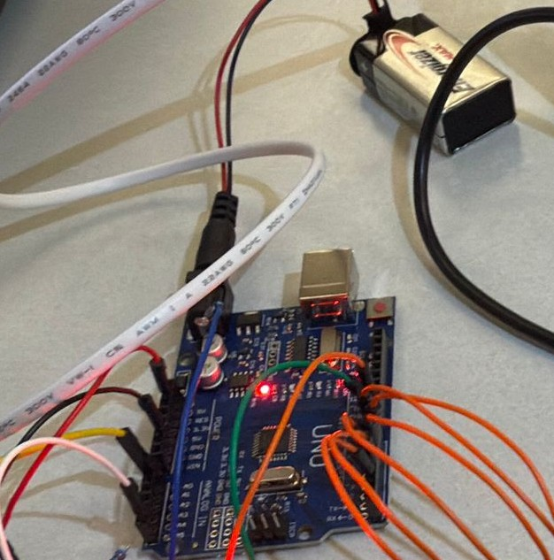
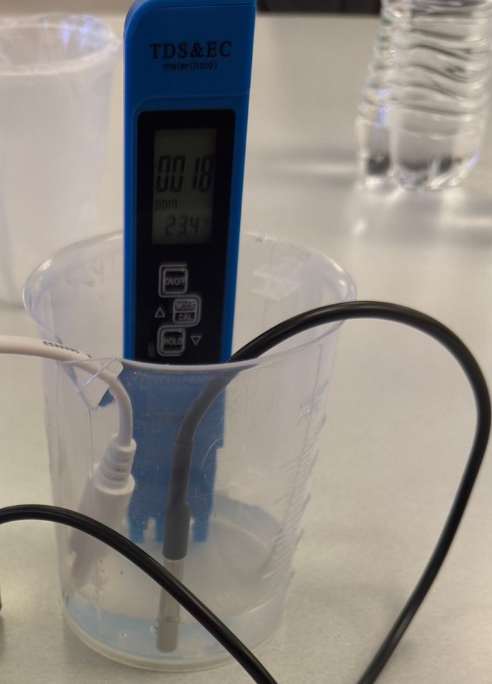

# 💧 Arduino TDS Salinity Sensor


A low-cost, Arduino-based **Total Dissolved Solids (TDS) / Salinity Sensor** built for water quality monitoring. This project demonstrates that a custom-built sensor using a Keystudio probe and Arduino Uno can match the performance of a commercial TDS meter — validated through rigorous statistical analysis.

> 📄 Built as a final project for **ME 5840 – Advanced Experimental Methods** at California State University, Los Angeles.

---

## 📌 Table of Contents

- [Overview](#overview)
- [Hardware Components](#hardware-components)
- [How It Works](#how-it-works)
- [Wiring & Setup](#wiring--setup)
- [Code](#code)
- [Calibration](#calibration)
- [Results](#results)
- [Statistical Analysis](#statistical-analysis)
- [Future Work](#future-work)
- [References](#references)

---

## 🔍 Overview

Salinity and dissolved solids measurement is critical in environmental monitoring, aquaculture, and agriculture. Commercial TDS meters can be expensive and inflexible. This project builds and validates a **DIY Arduino-based TDS sensor** that:

- Measures salt concentration (NaCl) in water from **0 to 1000 ppm**
- Displays TDS, EC (electrical conductivity), and temperature on a **16x2 LCD**
- Alerts the user via **LED and buzzer** when readings fall outside safe limits
- Was statistically proven to perform on par with a **commercial Vivosun TDS meter**



---

## 🔧 Hardware Components

| Component | Purpose |
|---|---|
| Arduino Uno | Microcontroller |
| Keystudio Metal Probe (TDS) | Homemade conductivity sensor |
| Vivosun TDS Meter | Commercial reference sensor |
| 16x2 LCD Display | Real-time output |
| Green & Red LEDs | Status indicators |
| Buzzer | Out-of-range alert |
| Digital Weighing Scale | Precise NaCl measurement |
| 9V Battery | Power supply |

---

## ⚙️ How It Works

The sensor measures **electrical conductivity** between two metal probes submerged in a solution. As NaCl dissolves in water, it increases the water's conductivity, which is then converted to a **TDS value in ppm**.

**Signal chain:**
```
Conductivity (µS) → Analog Voltage (0–2.3V) → Arduino ADC → EC Value → TDS (ppm)
```



The TDS is calculated using this formula:
```
TDS = (133.42 × EC³ - 255.86 × EC² + 857.39 × EC) × 0.5
```
Temperature compensation is applied at a fixed reference of **25°C**.

---

## 🔌 Wiring & Setup



| Arduino Pin | Connected To |
|---|---|
| A0 | TDS Sensor Signal |
| 2–7 | LCD (RS, EN, D4–D7) |
| 8 | Green LED |
| 9 | Red LED |
| 13 | Buzzer |

**Libraries required:**
- `LiquidCrystal.h` (built into Arduino IDE)

---

## 💻 Code

The full Arduino sketch is in [`tds_sensor.ino`](./tds_sensor.ino).

**Key logic summary:**
- Reads analog voltage from the TDS probe via pin A0
- Applies temperature compensation (fixed at 25°C)
- Converts EC to TDS using the manufacturer formula
- Displays TDS, EC, and temperature on the LCD
- Triggers red LED + buzzer if TDS < 50 ppm or > 700 ppm

---

## 🧪 Calibration



**Single-Point Calibration:**
1. Prepare a 500 ppm reference solution (0.5g NaCl per 1L distilled water)
2. Submerge sensor for 30 seconds
3. Adjust `ecCalibration` factor in code until reading matches 500 ppm
4. Clean probe and re-verify

The commercial Vivosun sensor was factory calibrated and confirmed against the same 500 ppm reference.

---

## 📊 Results

NaCl was added to 2L of distilled water in **0.1g increments** (~50 ppm per step), up to 1000 ppm, then reduced by dilution. Both sensors were compared at each step.

| NaCl (g) | Theoretical (ppm) | Arduino Sensor (ppm) | Commercial Sensor (ppm) |
|---|---|---|---|
| 0.0 | 0 | 3 | 0 |
| 0.5 | 250 | 249 | 247 |
| 1.0 | 500 | 497 | 518 |
| 1.5 | 750 | 737 | 731 |
| 2.0 | 1000 | 977 | 1008 |

**Sensor Performance Comparison:**

| Characteristic | Arduino Sensor | Commercial Sensor |
|---|---|---|
| Accuracy | ±0.9% | ±2% (0–2000 ppm) |
| Precision (std. dev) | ±2% | Manufacturer defined |
| Repeatability | ~1.5% | Not specified |
| Range | 0–1000 ppm | 0–9990 ppm |
| Sensitivity | 1.3 × 10⁻³ V/ppm | Not stated |

---

## 📈 Statistical Analysis

A **paired t-test** was used to determine if there was a meaningful difference between the two sensors.

| Metric | Value |
|---|---|
| Arduino Mean | 497.71 ppm |
| Commercial Mean | 499.67 ppm |
| Pearson Correlation | 0.9995 |
| t-statistic | -0.789 |
| p-value (two-tailed) | **0.864** |
| Significance Level (α) | 0.05 |

**Conclusion:** Since p = 0.864 >> 0.05, we **fail to reject the null hypothesis**. There is no statistically significant difference between the Arduino sensor and the commercial sensor.

Additional tests confirmed:
- ✅ **QQ Plot** — Data is approximately normally distributed (R² = 0.9699)
- ✅ **Hysteresis** — Minimal hysteresis; consistent performance in both increasing and decreasing concentration directions
- ✅ **95% Confidence Interval** — Arduino: [356.39, 638.53] ppm | Commercial: [356.26, 639.11] ppm

---

## 🔮 Future Work

- **Temperature Compensation:** Integrate a **DS18B20** temperature sensor for real-time compensation instead of assuming a fixed 25°C
- **Extended Range:** Expand calibration beyond 1000 ppm
- **Wireless Monitoring:** Add an ESP8266/ESP32 for IoT-based remote water quality tracking
- **Enclosure:** Design a waterproof housing for field deployment

---

## 👥 Authors

- Syed Ali Hassan
- Sagar Timbadiya
- Chirag Patel
- Sujeeth P.K

Department of Mechanical Engineering, California State University, Los Angeles

---

## 📚 References

- Wang, Z., et al. (2020). Development of a Low-Cost Arduino-Based Conductivity Sensor for Water Quality Monitoring. *Sensors, 20*(3), 757.
- Smith, J. (2018). *Arduino Programming for Beginners.* O'Reilly Media.
- Wheeler, A. J., & Ganji, A. R. (2012). *Introduction to Engineering Experimentation* (3rd ed.).
- Larsen, R. W. (2017). *Engineering with Excel* (5th ed.).

---

## 📄 License

This project is licensed under the MIT License — see the [LICENSE](./LICENSE) file for details.
